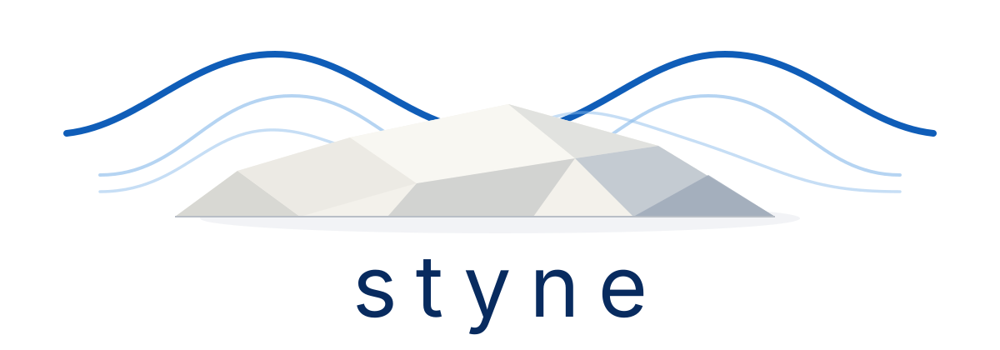
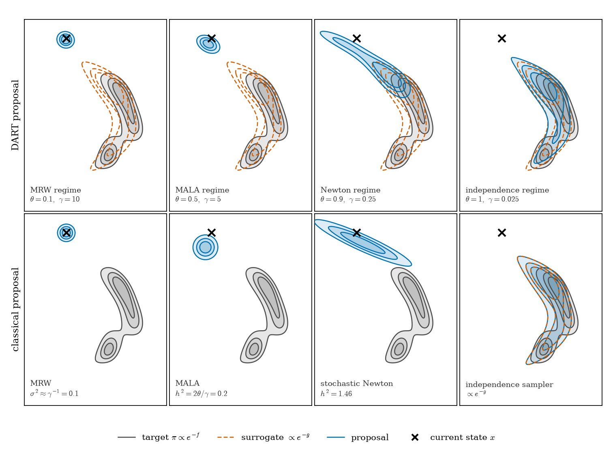

<p align="center">
  
</p>

<a href="https://zenodo.org/badge/latestdoi/1278349844">
  
</a>
[](https://arxiv.org/abs/2606.27564) [](https://doi.org/10.1137/24M1715854)

*Pre-1.0 (`v0.3.0`)*

`styne` is a Python library for high-dimensional Bayesian inference. It keeps
models, probability measures, and samplers composable while preserving
backend-native numerical state.

## Methods

[Delayed Acceptance with Regularisation and Tempering (DART)][dart-paper] is a
surrogate-assisted MCMC method that combines delayed acceptance with
regularisation and tempering. [Dirichlet-Neumann Averaging (DNA)][dna-paper]
provides Fourier-based Gaussian-process representations for efficient
simulation of high-dimensional Gaussian fields.

[dart-paper]: https://arxiv.org/abs/2606.27564
[dna-paper]: https://doi.org/10.1137/24M1715854

DART ratio estimation excludes the terminal proposal before burn-in and
thinning. IS and bridge corrections require at least one retained state;
second-order cumulant corrections require at least two. Bridge evaluation uses
two explicit trajectories. A configured zero-length subchain is handled as its
own symmetric proposal case and does not invoke a ratio estimator.

<p align="center">
  
</p>

The figure is generated by
[`examples/figures/dartProposalFamily.py`](examples/figures/dartProposalFamily.py).

## Install

Requires Python 3.10 or newer.

```bash
pip install styne
```

Optional features are installed separately:

```bash
pip install styne[jax]
pip install styne[torch]
pip install styne[plotting]
```

NumPy supports explicit gradients. JAX and PyTorch additionally provide
automatic differentiation where supported.

JAX supports compiled transformed trajectories. PyTorch samplers run eagerly,
and deterministic PyTorch operations can be compiled, but explicit
`torch.Generator` state is not supported inside a full-graph transformed
trajectory.

## Examples

The backend-neutral examples cover the main workflows:

- `examples/01_quickstart.py`: Bayesian linear regression.
- `examples/02_gp.py`: Gaussian-process representations.
- `examples/03_sglmm.py`: a spatial Poisson GLMM.
- `examples/04_hierarchical.py`: a named two-block Gibbs hierarchy.

Run a fast check with:

```bash
python examples/01_quickstart.py --backend numpy --smoke
```

The NumPy/SciPy PDE example is in
`examples_numpy/04_pde_inverse_problem.py`.

## Components

- MRW, MALA, pCN, pMALA, MLDA, DART, and Gibbs samplers.
- Dense, B-spline, and DNA Gaussian-process representations.
- Linear regression, spatial GLMMs, and custom `ForwardMap` models.
- NumPy, JAX, and PyTorch numerical backends.

State is immutable and backend-native. Sampling methods accept and return
explicit random states, and parameter updates use `with_*` methods.

`HierarchicalBayes` keeps the factors used to evaluate the joint density
separate from the invariant updates used by `BlockGibbs`. Add each non-root
factor with `add_conditional`, then add one full conditional or invariant
Metropolis-within-Gibbs update for every block with `add_update`, including
the root. Block names follow non-root order and then the root.

```python
hierarchy = (
    HierarchicalBayesModelBuilder()
    .set_root(rootMeasure, name="hyperparameters")
    .add_conditional(latentFactor, name="latent")
    .add_update(latentUpdate)
    .add_update(hyperparameterUpdate)
    .build()
)
```

```text
Parameter -> ForwardMap -> Likelihood / Density -> Sampler
```

## Benchmarks

The DART benchmarks and plotting command are documented in
[`benchmarks/README.md`](benchmarks/README.md).

## Citation

Please cite the DOI shown above. For exact reproducibility, cite the archived
version used in the analysis.

## Licence

MIT. See [LICENSE](LICENSE).
